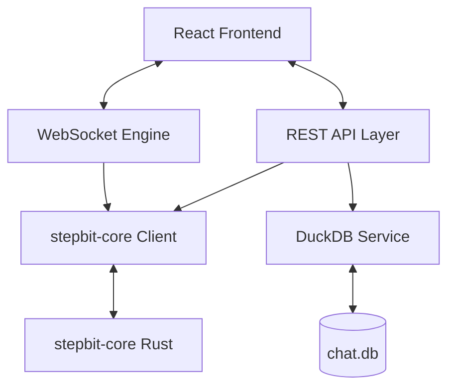

# stepbit-app Architecture

## 🛰️ System Overview

`stepbit-app` follows a clean architecture pattern adapted for Go's idiom:

### 1. API Layer (`/internal/api`)
Handles HTTP requests with a focus on **Zero-Allocation Routing** (using `Fiber`). It prioritizes low-latency JSON handling via specialized libraries like `goccy/go-json`.

### 2. Core Client (`/internal/core`)
Manages the REST/SSE connection to `stepbit-core`. It uses **Streaming Proxying** (Zero-Copy) to forward tokens from the core directly to the client without loading the entire response into memory.

### 3. Database Layer (`/internal/db`)
Encapsulates all DuckDB operations. It uses a **Prepared Statement Cache** and optimized connection pooling to ensure analytical queries don't block the main event loop.

### 4. WebSocket Engine (`/internal/ws`)
Manages real-time bidirectional communication with the browser, forwarding reasoning traces and tokens.
