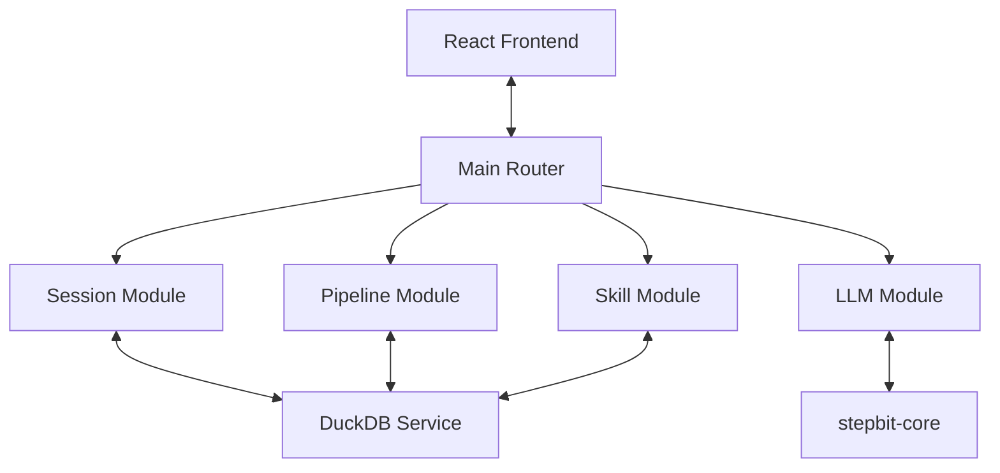

# 🏗️ Stepbit Go Architecture

`stepbit-app` is a high-performance LLM orchestration platform built with Go, featuring a modular, feature-based architecture. It provides a clean, maintainable bridge between raw LLM capabilities and premium AI applications.

---

## 🛰️ System Overview

The system follows a modern Go modular design:

- **Visual Layer (Frontend)**: React 19 / Vite interface.
- **Backend API (Go)**: Built with `Fiber` (Port 8080), providing high-performance routing and low-latency JSON handling.
- **Analytical Database**: Powered by **DuckDB**, enabling fast analytical queries and non-blocking snapshotting.
- **Reasoning Core**: Integration with `stepbit-core` for local cognitive tasks.

---

## 🧩 Modular Components (`/internal`)

The project is organized into self-contained feature modules. Each module follows a standardized **Models → Services → Handlers** structure.

### 1. [Session Module](file:///Users/joelguerra/Projects/ai_tools/stepbit-app/internal/session)
Manages chat history, persistence, and real-time WebSocket communication.
- **WebSocket Engine**: Handles bidirectional streaming of tokens and reasoning traces.
- **Chat Service**: Manages message flow and session state synchronization.

### 2. [Skill Module](file:///Users/joelguerra/Projects/ai_tools/stepbit-app/internal/skill)
Handles AI skill management, including dynamic preloading and discovery.
- **Skill Service**: Provides CRUD and preloading for reusable AI prompt templates.

### 3. [Pipeline Module](file:///Users/joelguerra/Projects/ai_tools/stepbit-app/internal/pipeline)
Manages complex AI workflows and multi-stage reasoning.
- **Pipeline Service**: Orchestrates the execution of deterministic, multi-node AI pipelines.

### 4. [LLM & Reasoning Module](file:///Users/joelguerra/Projects/ai_tools/stepbit-app/internal/llm)
Abstracts communication with LLM providers and the internal reasoning core.
- **Streaming Proxy**: Forwards tokens directly from `stepbit-core` or OpenAI to the client with zero-copy efficiency.

### 5. [Storage Module](file:///Users/joelguerra/Projects/ai_tools/stepbit-app/internal/storage)
Provides high-level data utilities and analytical features.
- **DuckDB Package**: Managed in `internal/storage/duckdb`, it handles connection pooling and schema initialization.

### 6. [Config Module](file:///Users/joelguerra/Projects/ai_tools/stepbit-app/internal/config)
Manages LLM provider verification, active model selection, and app-wide settings.

---

## 🔄 Data Flow (Go Implementation)

---

## 💎 Best Practices Followed

1. **Separation of Concerns**: Each feature is isolated in its own package with a dedicated `routes.go` and `RegisterRoutes` method.
2. **Interface-Based Design**: Services are injected into handlers, facilitating testing and future extensions.
3. **Low-Latency Networking**: Uses `Fiber` (fasthttp-based) and `goccy/go-json` for the most efficient request processing possible in Go.
4. **Concurrency Safety**: Implements proper thread-safe state management (`sync.RWMutex`) for configuration and session handling.
5. **Analytical-First Storage**: Utilizes DuckDB's analytical strengths while maintaining standard relational CRUD for operational data.
