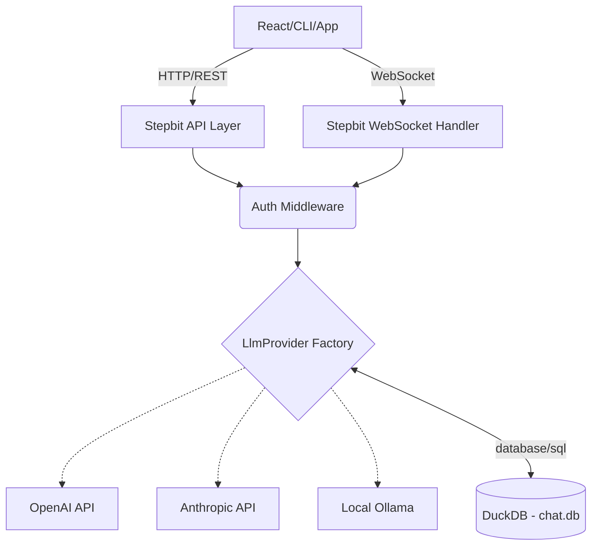

# Stepbit - LLM Command Center Specification (Final)

A premium, pluggable LLM orchestration platform built in Go with DuckDB for analytical conversation memory.

## Architecture Overview



## Configuration

All configuration via `config.yaml`:

```yaml
server:
  host: "127.0.0.1"
  port: 8080

database:
  path: "./chat.db"

auth:
  api_keys:
    - "sk-dev-key-123"
  token_expiry_hours: 24

llm:
  provider: "ollama"  # openai, anthropic, ollama
  model: "llama3.2"
  
  openai:
    api_base: "https://api.openai.com/v1"
    api_key: "${OPENAI_API_KEY}"
    default_model: "gpt-4o"
  
  anthropic:
    api_base: "https://api.anthropic.com"
    api_key: "${ANTHROPIC_API_KEY}"
    default_model: "claude-3-5-sonnet-20241022"
  
  ollama:
    base_url: "http://localhost:11434"
    default_model: "llama3.2"

chat:
  max_history_messages: 50
  system_prompt: "You are a helpful assistant."
```

## Database Schema

```sql
-- Sessions: separates unique conversation threads
CREATE TABLE sessions (
    id UUID PRIMARY KEY,
    name VARCHAR,
    created_at TIMESTAMP DEFAULT CURRENT_TIMESTAMP,
    updated_at TIMESTAMP DEFAULT CURRENT_TIMESTAMP,
    metadata JSON DEFAULT '{}'
);

-- Messages: stores history for context injected into LLM
CREATE TABLE messages (
    id BIGINT PRIMARY KEY DEFAULT nextval('seq_messages_id'),
    session_id UUID REFERENCES sessions(id) ON DELETE CASCADE,
    role VARCHAR NOT NULL,  -- 'system', 'user', 'assistant', 'tool'
    content TEXT NOT NULL,
    model VARCHAR,          -- provider model name
    token_count INTEGER,
    created_at TIMESTAMP DEFAULT CURRENT_TIMESTAMP,
    metadata JSON DEFAULT '{}'
);

-- Tool Results: cache for autonomous tools
CREATE TABLE tool_results (
    id BIGINT PRIMARY KEY DEFAULT nextval('seq_tool_results_id'),
    session_id UUID,
    source_url VARCHAR,
    content TEXT NOT NULL,
    created_at TIMESTAMP DEFAULT CURRENT_TIMESTAMP
);

-- Skills: reusable prompt templates
CREATE TABLE skills (
    id BIGINT PRIMARY KEY DEFAULT nextval('seq_skills_id'),
    name VARCHAR NOT NULL,
    content TEXT NOT NULL,
    tags VARCHAR DEFAULT '',
    source_url VARCHAR,
    created_at TIMESTAMP DEFAULT CURRENT_TIMESTAMP,
    updated_at TIMESTAMP DEFAULT CURRENT_TIMESTAMP
);

-- Pipelines: structured reasoning workflows
CREATE TABLE pipelines (
    id BIGINT PRIMARY KEY DEFAULT nextval('seq_pipelines_id'),
    name VARCHAR NOT NULL,
    definition JSON NOT NULL,
    created_at TIMESTAMP DEFAULT CURRENT_TIMESTAMP,
    updated_at TIMESTAMP DEFAULT CURRENT_TIMESTAMP
);
```

## API Endpoints

### Authentication
Require `Authorization: Bearer <api_key>` header for all endpoints except `/health`.

### REST API

| Method | Endpoint | Description |
|--------|----------|-------------|
| `GET` | `/health` | Health check |
| `POST` | `/sessions` | Create session |
| `GET` | `/sessions` | List sessions |
| `PATCH` | `/sessions/:id` | Update session |
| `DELETE` | `/sessions/:id` | Delete session |
| `GET` | `/sessions/:id/messages` | Get history |
| `GET` | `/sessions/:id/export` | Export as .txt |
| `POST` | `/sessions/import` | Import from .txt |
| `GET` | `/api/stats` | System telemetry |
| `GET` | `/pipelines` | List reasoning pipelines |
| `POST` | `/pipelines/:id/execute` | Run cognitive pipeline |
| `GET` | `/skills` | List persona templates |
| `GET` | `/stepbit-core/status` | Heartbeat for reasoning engine |
| `POST` | `/v1/chat/completions` | OpenAI Adapter |

### WebSocket

| Endpoint | Description |
|----------|-------------|
| `/ws/chat/:session_id` | Real-time streaming |

**WS Frame Format:**
- Client: 
    - `{ "type": "message", "content": "hello" }`
    - `{ "type": "cancel" }` - Aborts the active generation/tool task.
- Server: 
    - `{ "type": "chunk", "content": ".." }` -> Streaming content.
    - `{ "type": "status", "content": "Searching..." }` -> UI status pulse.
    - `{ "type": "done" }` -> End of response.
    - `{ "type": "error", "content": "..." }`

## Provider Interface

```go
type Provider interface {
    Name() string
    Chat(messages []Message, options ChatOptions) (ChatResponse, error)
    ChatStreaming(messages []Message, options ChatOptions, tx chan<- StreamMessage) error
    ExecutePipeline(pipeline any, question string, rlmEnabled bool) (PipelineExecuteResult, error)
    SupportedModels() []string
}
```

## Frontend Features

The project includes a modern React-based admin dashboard and chat interface with the following capabilities:

### Rich Chat Interface
- **Markdown Rendering**: Full GitHub Flavored Markdown support.
- **Syntax Highlighting**: Code blocks with language detection and premium themes.
- **Table Support**: Formatted markdown tables with responsive scrolling.
- **Image/SVG Rendering**: Support for inline images from URLs and **Live SVG Preview** for code blocks.
- **Interactive Charts**: Responsive Bar/Line charts with "bucketed" high-resolution data support.
- **Thinking Indicators**: Real-time feedback for searching and processing states.
- **Process Control**: Ability to cancel long-running tasks via the UI.
- **Raw/Formatted Toggle**: Instantly switch between rendered markdown and raw plain text.
- **Dynamic Personalities**: Override system prompts per session via JSON metadata.

### Dashboard Statistics
- **Tokens Tracking**: Real-time estimation and reporting of token usage.
- **Byte-Perfect Storage**: Accurate DB size monitoring and display.
- **Smart Formatting**: K/M suffixes for high-volume metrics.
- **Health Checks**: Live status indicators for API and Database connectivity.

## Project Structure

```
cmd/
├── stepbit-app/     # Main application entrypoint
internal/
├── api/             # Fiber router and OpenAI-compatible chat endpoint
├── config/          # Configuration services and handlers
├── core/            # stepbit-core client and integration logic
├── cron/            # Scheduled job proxy module
├── events/          # Trigger and event proxy module
├── execution/       # Local execution history tracking
├── llm/             # MCP, reasoning, and core-status handlers
├── pipeline/        # Pipeline CRUD and execution
├── session/         # Sessions, messages, import/export, stats
├── skill/           # Skills CRUD
├── storage/         # DuckDB connection and SQL tooling
web/
├── src/             # React UI
└── dist/            # Built frontend assets
```
